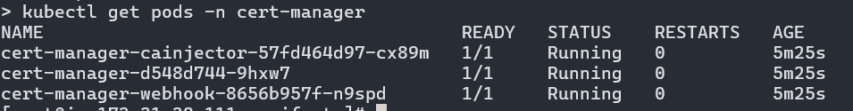
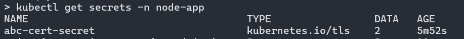

# <center>Node Hostname App</center>
Hosting https://github.com/cristiklein/node-hostname on Kubernetes

## Prerequisites

This project requires following prerequisites to be satisfied
- kubectl (v1.30.3) with credentials configured
- azure-cli (2.38.2)
- docker (25.0.3)

### Git Clone

Clone the repository locally and follow the rest of the steps.

```https://github.com/iam-parth/node-hostname-app.git``` \
```cd node-hostname-app ```

### Creating Docker image (Optional)

For the sake of this tutorial, the Docker image of this application has been pushed to docker hub and it is publically available. But if you want to use your own container repository, you can build and push the image using below commands.

```docker login <private-repo-url> -u <docker_username>```\
``` docker build -t <remote_docker_uri> . ```\
```docker push <remote_docker_uri>```

You would also reuqire to update the value of `image` parameter in **deployment.yml** file with <remote_docker_uri>

### Updating manifests

Replace the string `DOMAIN_NAME` with the domain name of the application in ***ingress-tls.yml*** and ***certificate.yml*** files.
Replace the string `SSL_VALIDATION_EMAIL` with a valid email address in ***cluster-issuer.yml*** file.

### Creating Namespace

```cd manifests``` \
```kubectl apply -f  namespace.yml```

This will create a Kubernetes namespace called `node-app` in which we will deploy our application as well as certificates and ingress resources.


### Installing Ingress controller

```
helm repo add ingress-nginx https://kubernetes.github.io/ingress-nginx
helm repo update
helm install nginx-ingress ingress-nginx/ingress-nginx --namespace node-app
kubectl get pods --namespace node-app -l app.kubernetes.io/name=ingress-nginx
```


### Application Deployment

Once the ingress controller is deployed, we can deploy the application and ingress.

```kubectl apply -f deployment.yml```

### Installing Ingress

```kubectl apply -f ingress.yml```

### Updating the DNS Record

Get the public IP address of the ingress controller service by running ***kubectl get svc -n node-app*** and update the DNS accordingly. It may take some time after creating an 'A' record when it starts refelecting and you can proceed with the next steps.

### Installing cert manager

```
kubectl apply --validate=false -f https://github.com/jetstack/cert-manager/releases/download/v1.8.0/cert-manager.crds.yaml
helm repo add jetstack https://charts.jetstack.io
helm repo update
helm install cert-manager jetstack/cert-manager --namespace cert-manager --create-namespace
```

### Installing Cluster Issuer

Cluster issuer is responsible for managing the certificate issueance process. It is used by the ***certificate*** resource for calling the certificate provider, managing order and challenges and getting the certificate issued.

``` kubectl apply -f cluster-issuer.yml```

Wait for the cluster issuer pods are ready.



### Installing Certificate

After the certificate issuer is installed, it can be used for configuring the SSL certificate. In our example we are using the Let's Encrypt certificate.

```kubectl apply -f certificate.yml```

The certificate issueance can take upto few minutes and you can verify the status by running ***kubectl  describe certificate node-app-cert -n node-app*** command and check the event section. There should be an event with message of certificate issued successfully.

After the certificate is issued, it will be stored in a secret called abc-cert-secret.




### Updating ingress

Once the certificate is issued and secret is created, it is ready to be used by the application. You can update the ingress for configuring this certificate by running below command.

```kubectl apply -f ingress-tls.yml```

Once the ingress is updated, you should be able to access the website via HTTPS.

---
